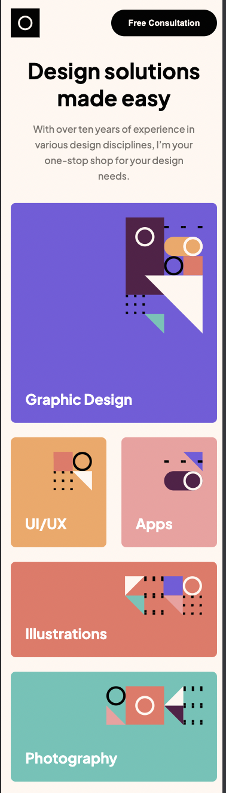

# Frontend Mentor - Single-page design portfolio solution

This is a solution to the [Single-page design portfolio challenge on Frontend Mentor](https://www.frontendmentor.io/challenges/singlepage-design-portfolio-2MMhyhfKVo). Frontend Mentor challenges help you improve your coding skills by building realistic projects. 

## Table of contents

- [Overview](#overview)
  - [The challenge](#the-challenge)
  - [Screenshot](#screenshot)
  - [Links](#links)
- [My process](#my-process)
  - [Built with](#built-with)
  - [What I learned](#what-i-learned)
  - [Continued development](#continued-development)
  - [Useful resources](#useful-resources)
- [Author](#author)

## Overview

### The challenge

The most challengin part was the carousel. Even though, I did not make exactly the same as the example. I am proud of it!
Also tried to do my best, doing the most optimal layout (Mobile - Tablet - Desktop)
Users should be able to:

- View the optimal layout for the site depending on their device's screen size
- See hover states for all interactive elements on the page
- Navigate the slider using either their mouse

### Screenshot

### Links

- Solution URL: [Add solution URL here](https://www.frontendmentor.io/solutions/single-page-design-portfolio-TKgNEP8FpP)
- Live Site URL: [Add live site URL here](https://single-page-design-portfolio-7zh14trkq-aavv8931.vercel.app/)

## My process

### Built with

- Semantic HTML5 markup
- CSS custom properties
- Flexbox
- Mobile-first workflow

### What I learned

I put in practice what I have learned CSS and HTML structure once again. To me, practice JS is new, so doing this carousel was challenging. Use this section to recap over some of your major learnings while working through this project. Writing these out and providing code samples of areas you want to highlight is a great way to reinforce your own knowledge.

### Continued development

I will keep practicing JS and CSS. I said CSS because I want to code in a precise way without too much code :( 
I recognized that I wanted to refactor in the best possible way and make my code shorter. But I am here to learn.

### Useful resources

- [How to make a carousel with Vanilla JS](https://blog.logrocket.com/build-image-carousel-from-scratch-vanilla-javascript/) - This helped me to understand how a carousel work. I really liked this pattern and will use it going forward.

## Author

- Website - [Arturo Veintimilla]
- Frontend Mentor - [@aavv8931](https://www.frontendmentor.io/profile/aavv8931)

